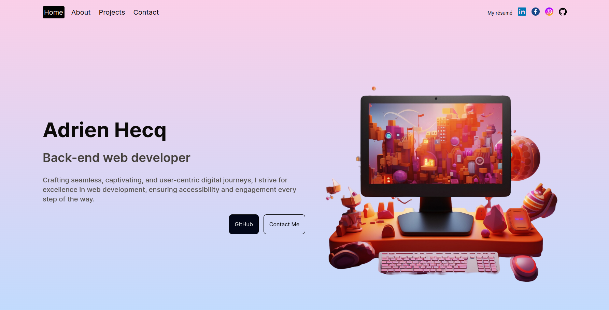

# AdrienHq-Portfolio-V2

This is the second iteration of my personnal portfolio. 



### Stack

- Next.js
- React
- Framer Motion
- Tailwind CSS

## Install

### Clone the repository

```shell
  git clone https://github.com/AdrienHq/AdrienHq-Portfolio-V2.git
  cd AdrienHq-Portfolio-V2
```

### Install dependencies

```shell
  npm install
```

#### or

```shell
  yarn install
```

### Run the Development Server

```shell
  npm run dev
```

#### or

```shell
  yarn dev
```